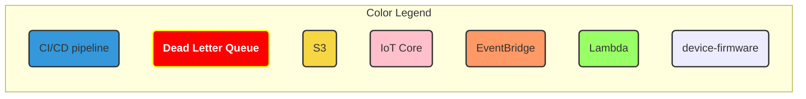
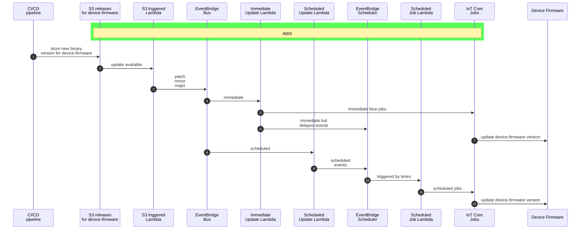

# Device Firmware Update
Describes Device Firmware Update

#### [back to main document](./firmware-update-design.md)
#### [view lambda interface](./firmware-update-lambda-io.md)

[TOC]

## Device Update Requirements.
Instead of creating a typical Req/Resp RESTful API to update our devices, we should create an Event driven update strategy to satisfy all requirements for device updates.
Here are the requirements:

- set devices to auto-update
- hold off updates
- update devices as soon as update becomes available
- update only patch versions: bug fixes, security fixes
- update only minor versions: patch + features with backwards compatibility
- update major versions: all updates
- possibility to update at specific time
- possibility to do blue/green update rollout
- possibility to rollback an update
- possibility update group of devices as well as individual devices

## Event driven design 3
### Overview

```mermaid
graph LR
    subgraph AWS
        s3(S3 device-firmware<br>release bucket) --> s3_lambda(S3 triggered &lambda;)
        s3_lambda --> |patch<br>minor<br>major| eb_bus(EventBridge<br>Bus)
        eb_bus --> |immediate| iu_lambda(immediate<br>update &lambda;)
        eb_bus --> |scheduled| su_lambda(scheduled<br>update &lambda;)
        iu_lambda --> |immediate<br>blue jobs| iot_core_jobs(IoT Core<br>Jobs)
        iu_lambda --> |immediate but<br>delayed events | eb_scheduler(EventBridge<br>Scheduler)
        su_lambda --> |scheduled<br> events| eb_scheduler
        eb_scheduler --> |triggered<br>by timer| sj_lambda(Scheduled<br>Jobs &lambda;)
        sj_lambda --> |scheduled<br>jobs| iot_core_jobs
        eb_scheduler --> |failed<br>events| dlq(Dead Letter Queue)
    end
    pipeline(CI/CD<br>pipeline) --> |compiled<br>binaries| s3
    iot_core_jobs --> |update| device_firmware(device-firmware)

    classDef PIPELINE fill:#3498db,stroke:#333,stroke-width:2px
    classDef BAD_BAD_EVENT fill:#f00,color:white,font-weight:bold,stroke-width:2px,stroke:yellow
    classDef S3 fill:#f6d743,stroke:#333,stroke-width:2px
    classDef IOT_CORE fill:#ffc0cb,stroke:#333,stroke-width:2px
    classDef EVENT_BRIDGE fill:#f96,stroke:#333,stroke-width:2px;
    classDef LAMBDA fill:#9f6,stroke:#333,stroke-width:2px

    class pipeline PIPELINE
    class dlq BAD_BAD_EVENT
    class s3 S3
    class eb_bus EVENT_BRIDGE
    class eb_scheduler EVENT_BRIDGE
    class iu_lambda LAMBDA
    class su_lambda LAMBDA
    class iot_core_tg IOT_CORE
    class iot_core_jobs IOT_CORE
    class iot_core_jobs IOT_CORE
    class s3_lambda LAMBDA
    class sj_lambda LAMBDA
```

### device-firmware update Sequence Diagram

