# Problem-Solving Patterns and Complexity Analysis

This comprehensive guide provides visual frameworks for recognizing patterns and analyzing complexity in technical interviews.

## Master Pattern Recognition Framework

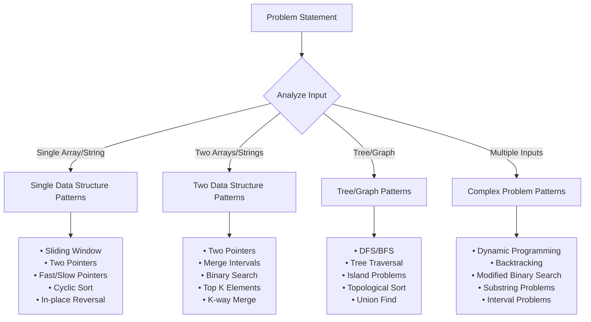

## Pattern-to-Problem Mapping

### Sliding Window Pattern

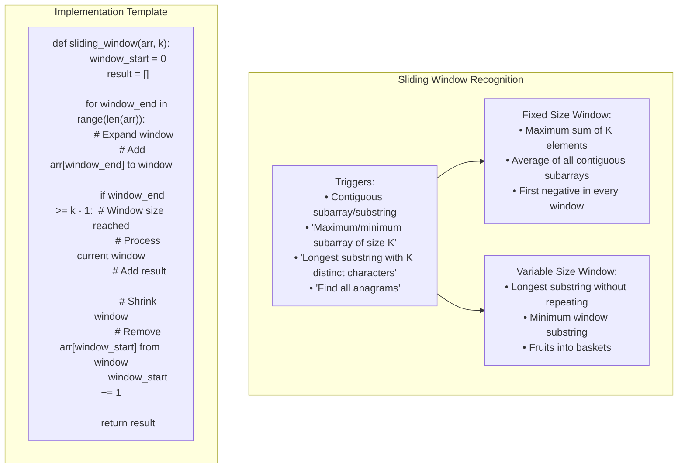

### Two Pointers Pattern

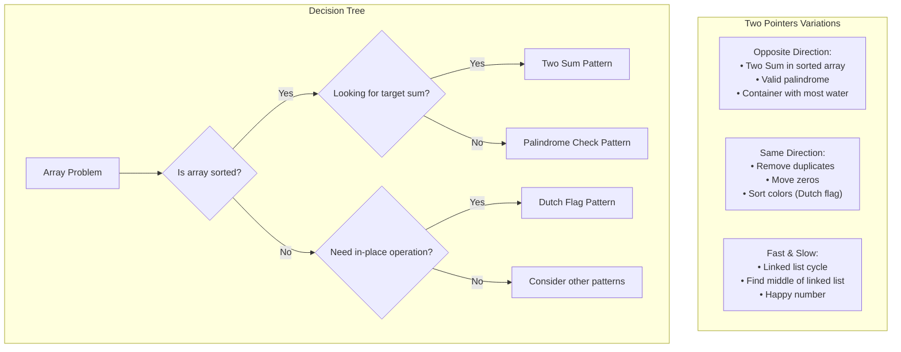

### Binary Search Pattern

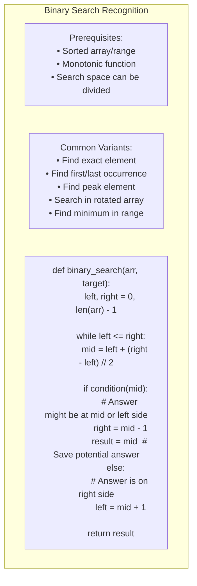

## Dynamic Programming Patterns

### DP Problem Classification

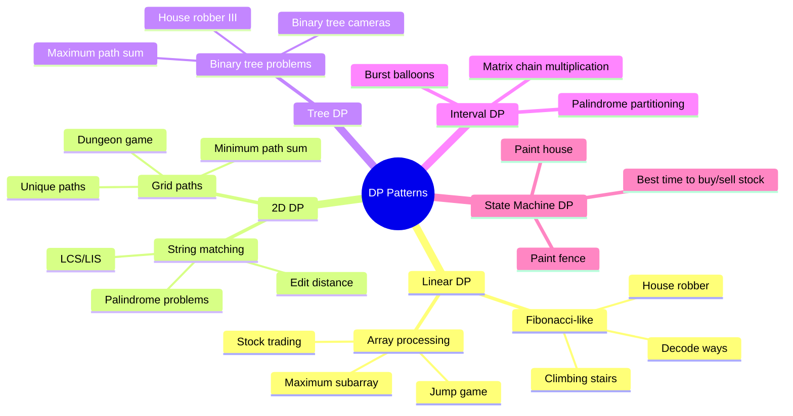

### DP Recognition Framework

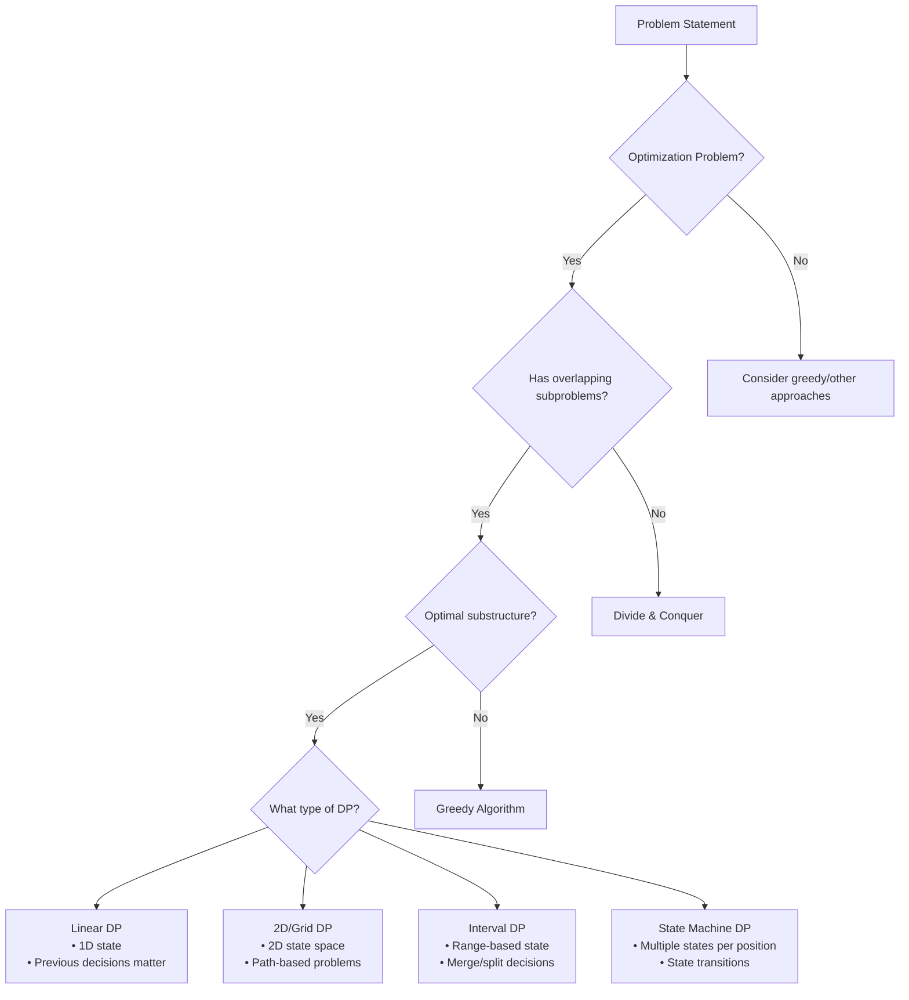

## Complexity Analysis Framework

### Time Complexity Hierarchy

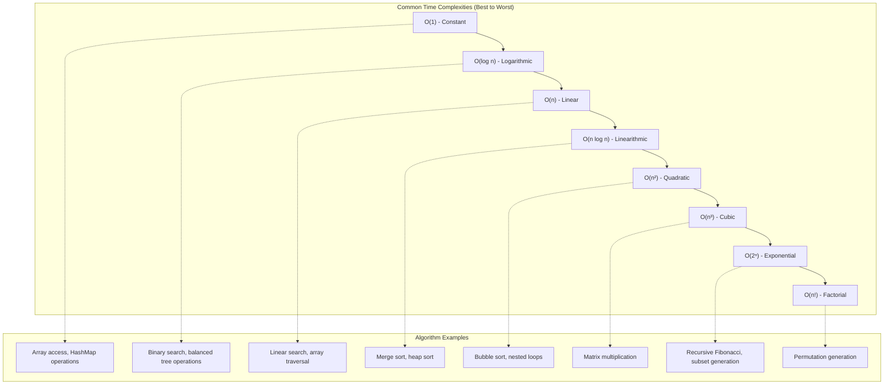

### Space Complexity Analysis

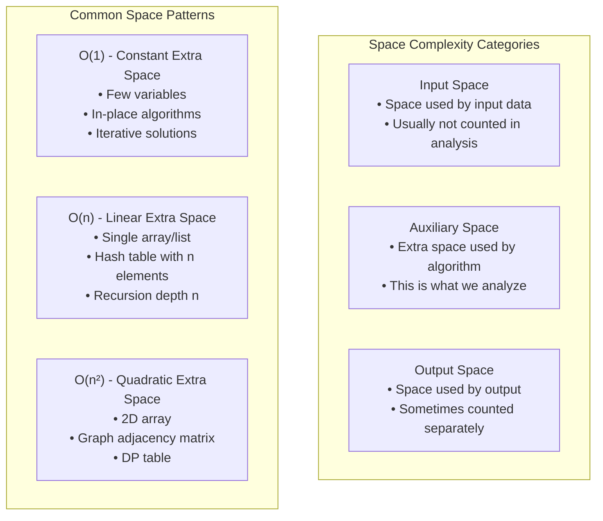

### Amortized Analysis

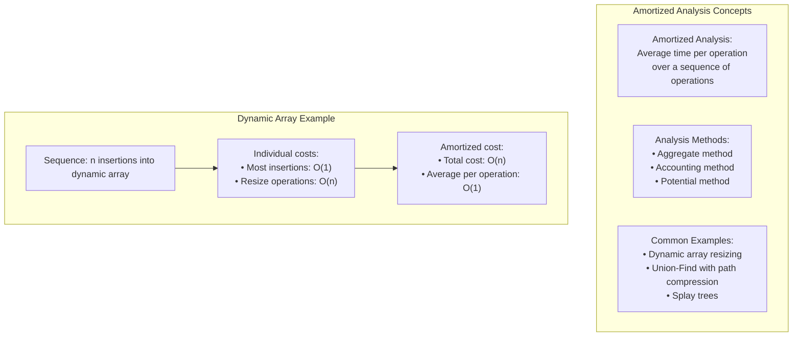

## Problem Classification by Constraints

### Constraint-Based Strategy Selection

```mermaid
flowchart TD
    Constraints[Problem Constraints] --> Size{Input Size}
    
    Size -->|n ≤ 20| Exponential[O(2ⁿ) or O(n!) acceptable<br/>• Backtracking<br/>• Complete search<br/>• Dynamic programming with bitmask]
    
    Size -->|n ≤ 100| Cubic[O(n³) acceptable<br/>• Floyd-Warshall<br/>• Matrix multiplication<br/>• Triple nested loops]
    
    Size -->|n ≤ 1000| Quadratic[O(n²) acceptable<br/>• Bubble sort variations<br/>• Simple DP<br/>• Nested loop solutions]
    
    Size -->|n ≤ 10⁵| Linearithmic[O(n log n) needed<br/>• Merge sort<br/>• Binary search applications<br/>• Heap operations]
    
    Size -->|n ≤ 10⁶| Linear[O(n) or O(n log n) required<br/>• Linear scan<br/>• Hash table operations<br/>• Efficient sorting]
    
    Size -->|n > 10⁶| Sublinear[Better than O(n) needed<br/>• O(log n) binary search<br/>• O(1) mathematical solutions<br/>• Specialized algorithms]
```

### Memory Constraint Analysis

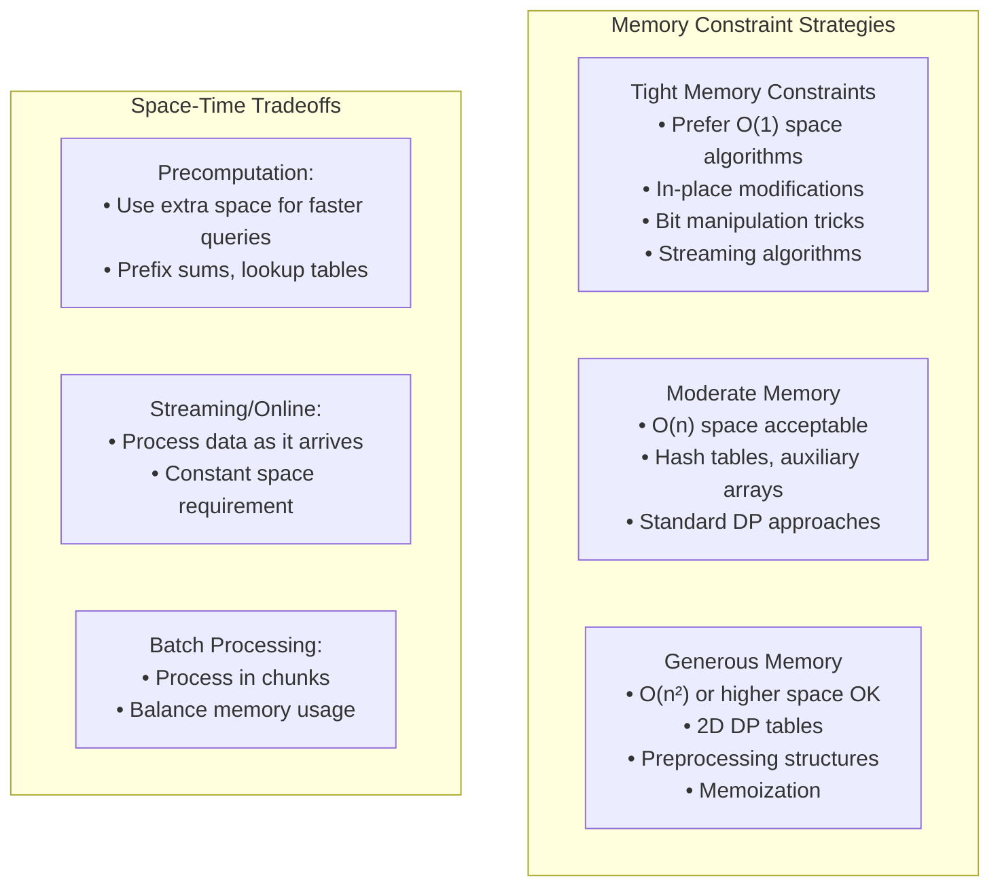

## Advanced Pattern Recognition

### Interval Problems Pattern

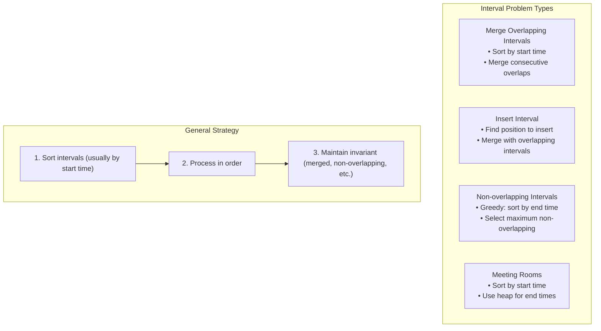

### Tree Traversal Patterns

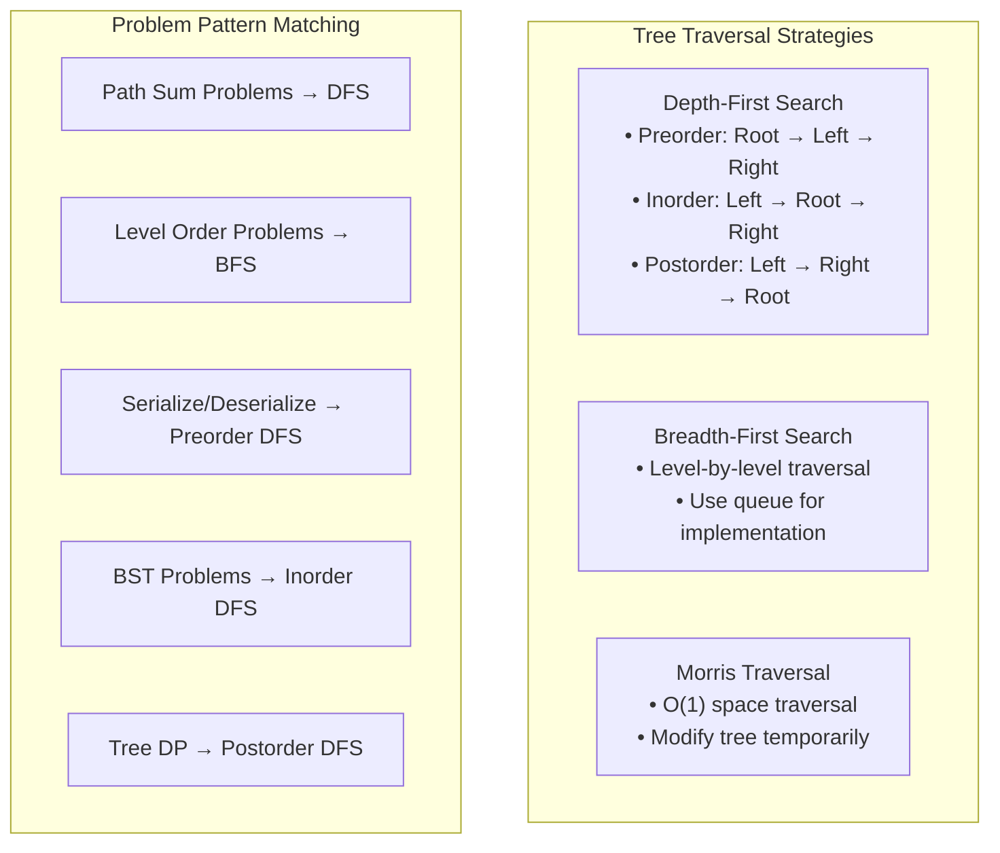

## Interview Strategy Framework

### Problem-Solving Process

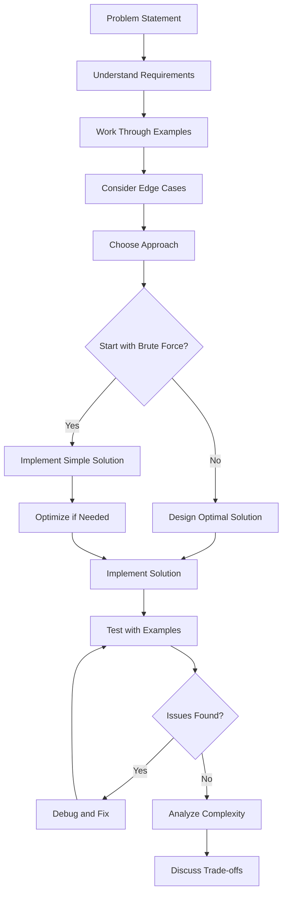

### Communication Strategy

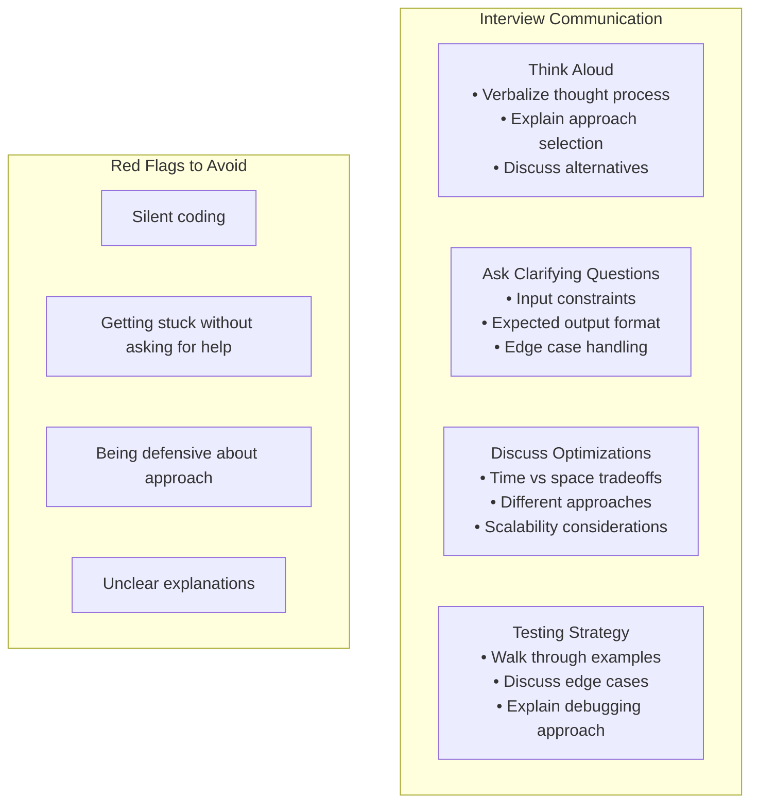

## Complexity Cheat Sheet

### Quick Reference Table

| Operation | Best | Average | Worst |
|-----------|------|---------|-------|
| Array Access | O(1) | O(1) | O(1) |
| Array Search | O(1) | O(n) | O(n) |
| Array Insert | O(1) | O(n) | O(n) |
| Binary Search | O(1) | O(log n) | O(log n) |
| Quick Sort | O(n log n) | O(n log n) | O(n²) |
| Merge Sort | O(n log n) | O(n log n) | O(n log n) |
| Hash Table | O(1) | O(1) | O(n) |
| BST | O(log n) | O(log n) | O(n) |
| Heap Insert | O(1) | O(log n) | O(log n) |
| Graph BFS/DFS | O(V) | O(V+E) | O(V+E) |

### Master Theorem

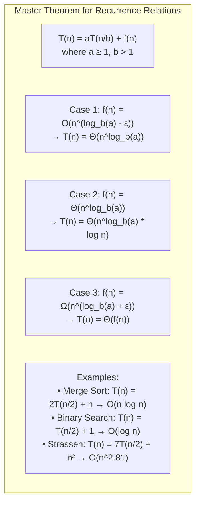

## Key Takeaways

1. **Pattern Recognition**: Most interview problems fall into well-known patterns
2. **Constraint Analysis**: Input size determines acceptable time complexity
3. **Trade-offs**: Always consider time vs space trade-offs
4. **Communication**: Clear explanation is as important as correct solution
5. **Optimization**: Start simple, then optimize based on requirements
6. **Edge Cases**: Always consider boundary conditions and special cases

This framework provides a systematic approach to tackling technical interview problems across various domains and complexity levels.