# Basic String Operations - Visual Guide

This guide covers fundamental string operations with step-by-step visualizations and complexity analysis.

## String Reversal Algorithms

### Two-Pointer Approach (In-Place)

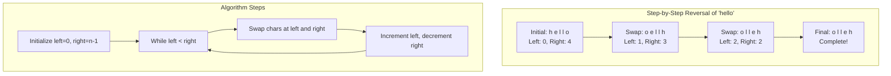

**Complexity:** Time O(n), Space O(1)

### Recursive Approach

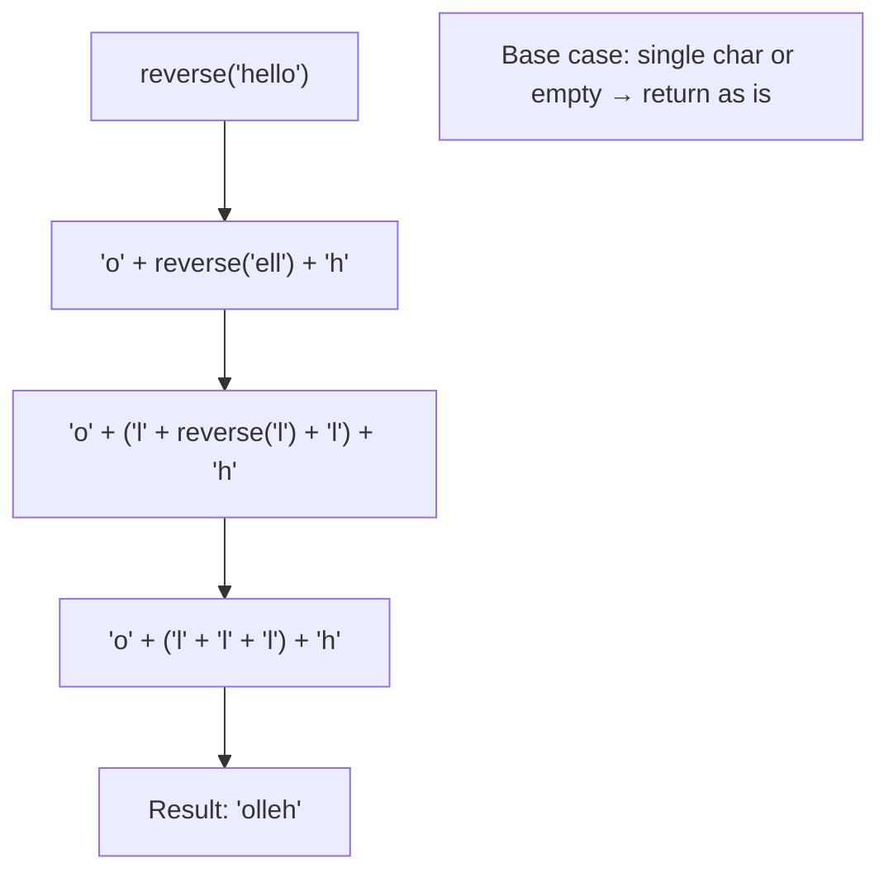

**Complexity:** Time O(n), Space O(n) due to call stack

## Character Frequency Analysis

### HashMap-Based Counting

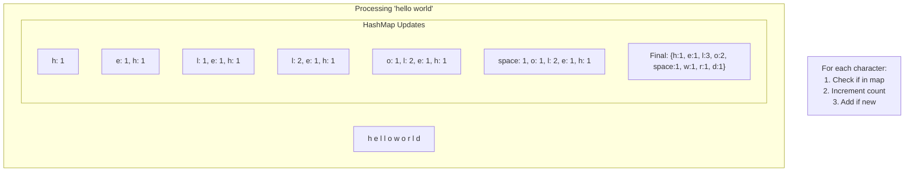

### Array-Based Counting (ASCII)

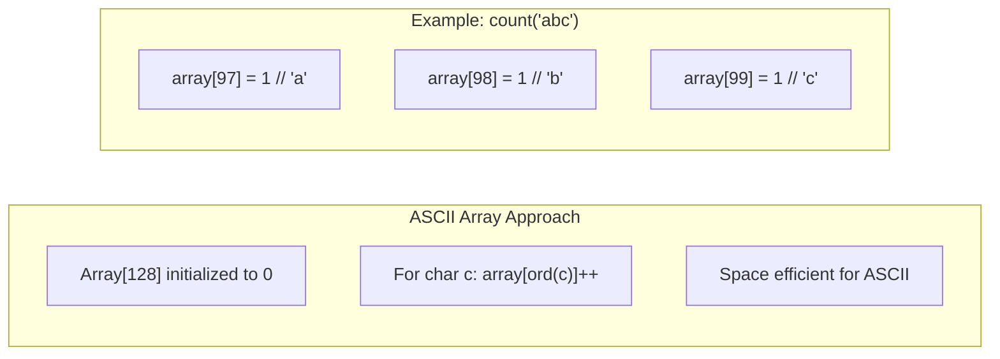

**Complexity:** Time O(n), Space O(1) for ASCII, O(k) for Unicode

## Subsequence Detection

### Two-Pointer Technique

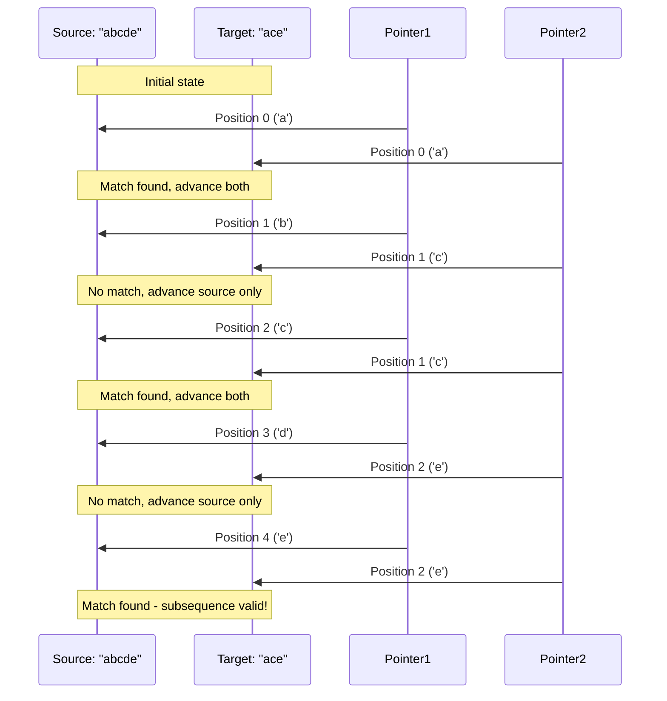

## String Rotation

### Left Rotation by K Positions

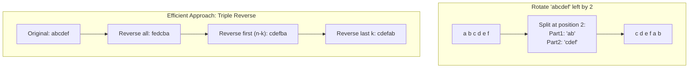

**Algorithm Steps:**
1. Reverse entire string
2. Reverse first (n-k) characters  
3. Reverse last k characters

**Complexity:** Time O(n), Space O(1)

## Duplicate Removal

### Preserve Order Approach

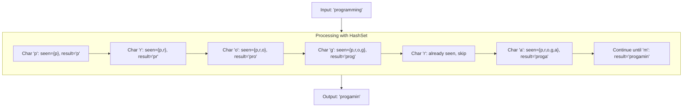

### Two-Pointer In-Place (Sorted String)

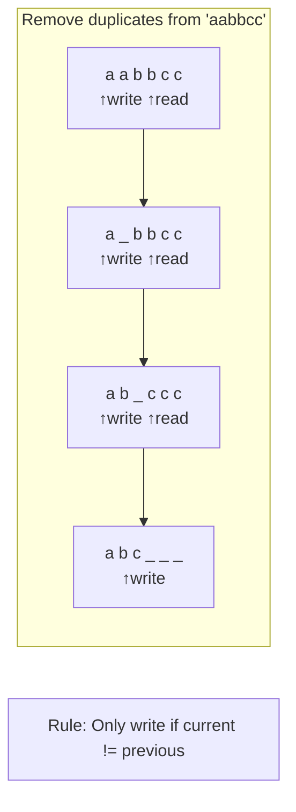

## Most Frequent Character

### Single Pass with Tracking

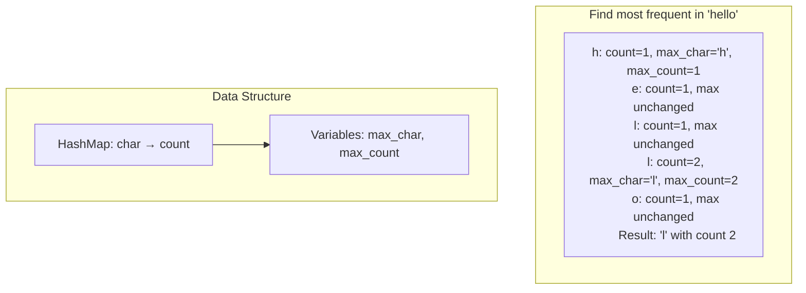

## First Unique Character

### Two-Pass Approach

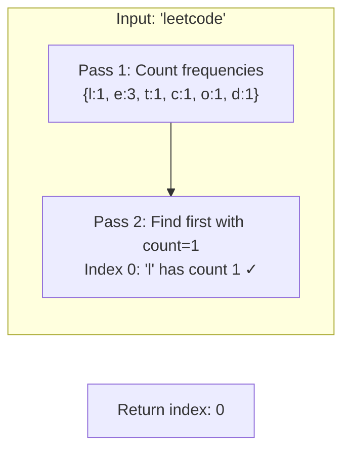

### Single-Pass Approach

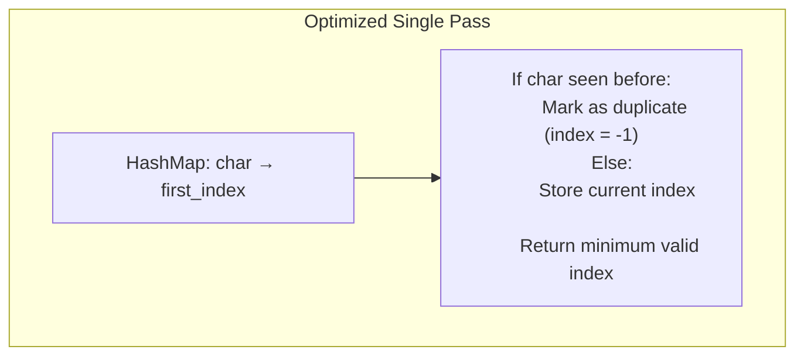

## Performance Comparison

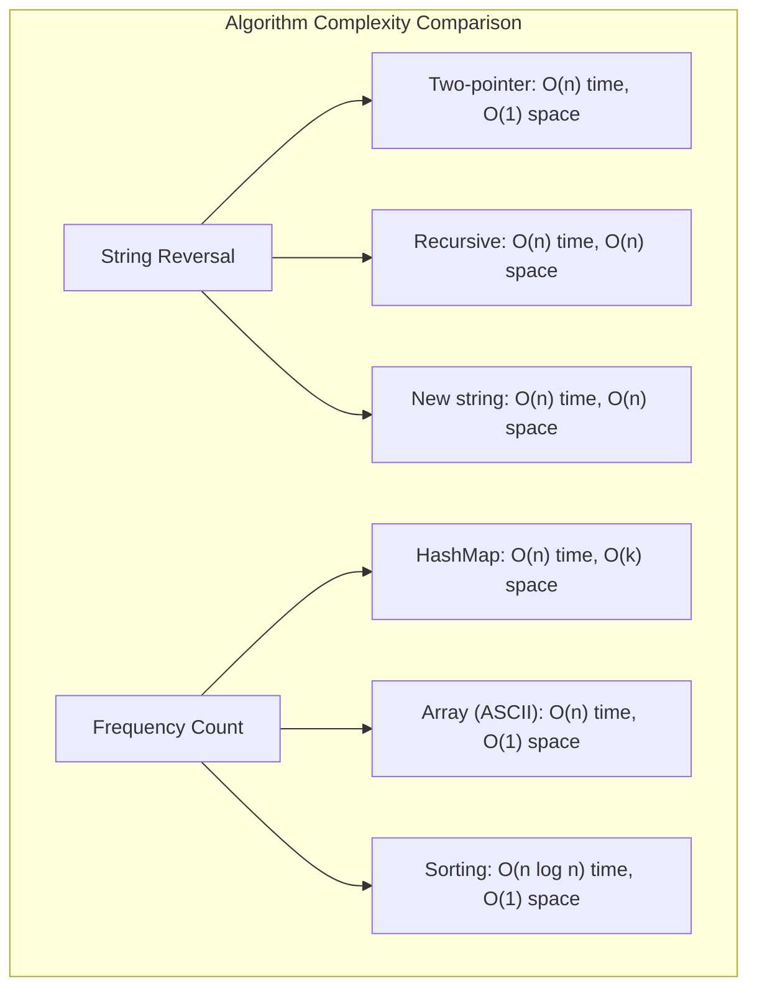

## Practice Problems Mapping

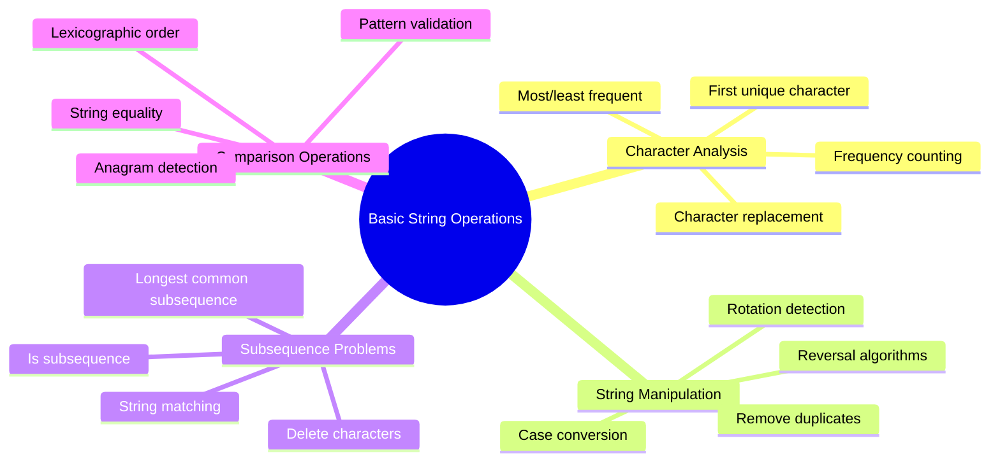

## Key Insights

1. **In-place vs Extra Space**: Consider memory constraints
2. **ASCII vs Unicode**: Choose appropriate data structures
3. **Single vs Multiple Pass**: Balance between time and space
4. **Edge Cases**: Empty strings, single characters, all same characters
5. **Optimization**: Use bit manipulation for character sets when possible

## Next: [Pattern Matching Algorithms →](pattern-matching.md)