# Dynamic Programming on Strings - Visual Guide

This guide covers essential string DP problems with detailed visualizations and state transition analysis.

## DP on Strings Problem Categories

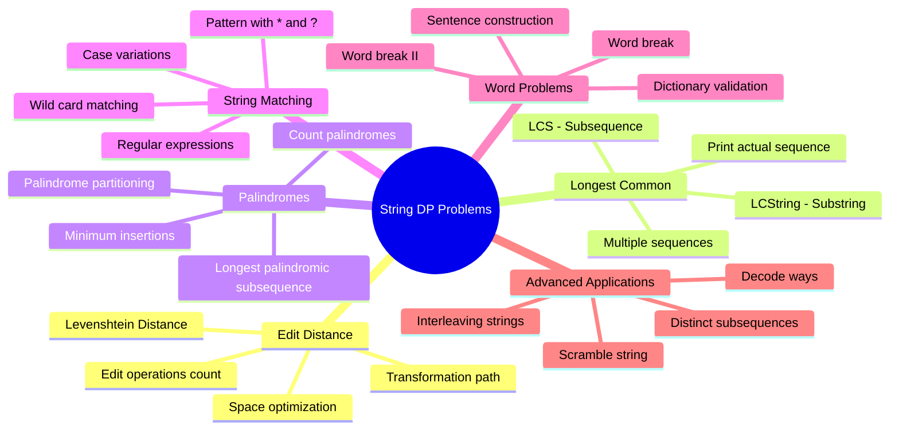

## Edit Distance (Levenshtein Distance)

### State Definition and Recurrence

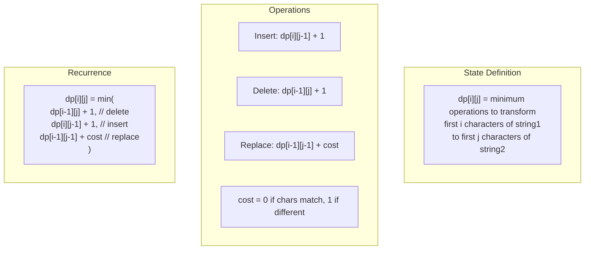

### Step-by-Step Example: "horse" → "ros"

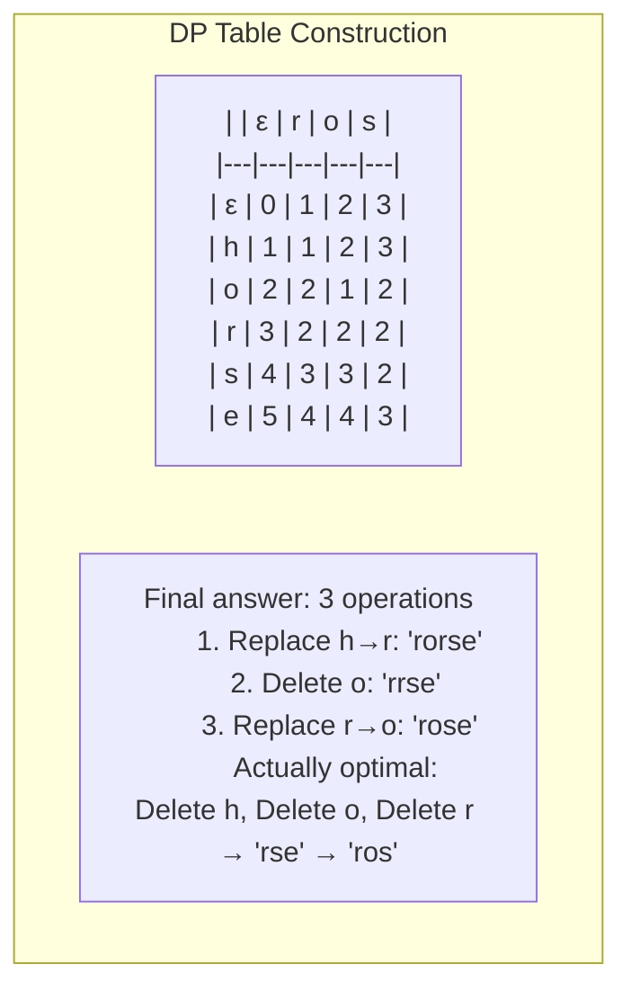

### Space Optimization

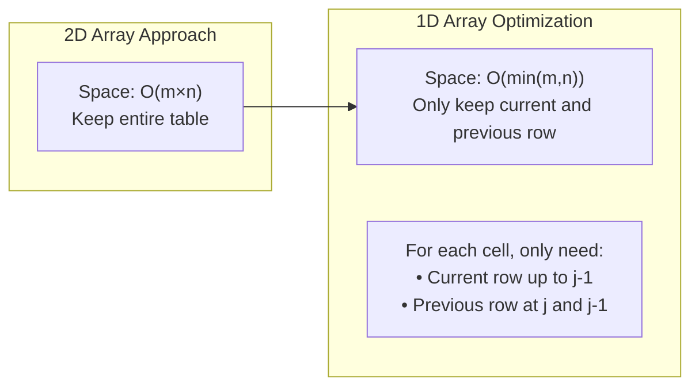

## Longest Common Subsequence (LCS)

### LCS Recurrence Relation

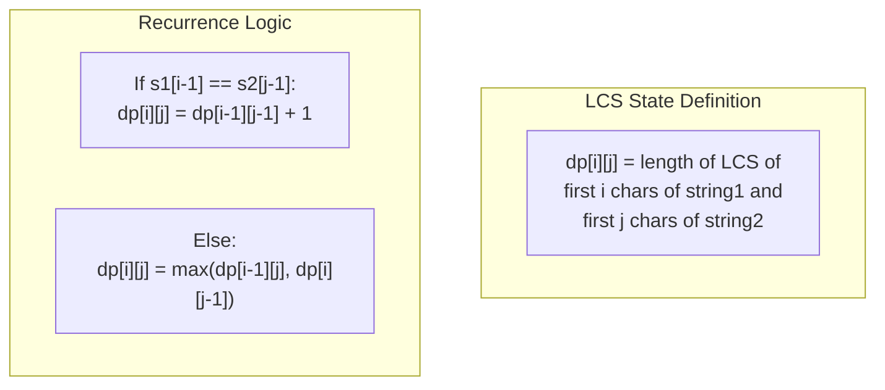

### LCS Example: "ABCDGH" and "AEDFHR"

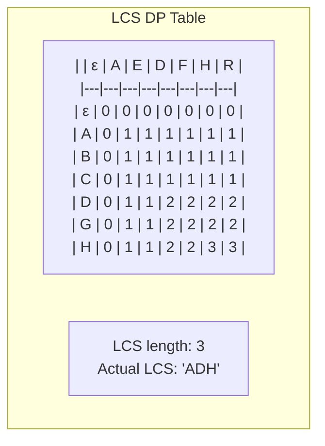

### Reconstructing the LCS

```mermaid
flowchart TD
    Start["Start at dp[m][n]"] --> Check{s1[i-1] == s2[j-1]?}
    
    Check -->|Yes| AddChar["Add character to LCS<br/>Move to dp[i-1][j-1]"]
    Check -->|No| Compare{dp[i-1][j] > dp[i][j-1]?}
    
    Compare -->|Yes| MoveUp["Move to dp[i-1][j]"]
    Compare -->|No| MoveLeft["Move to dp[i][j-1]"]
    
    AddChar --> End{Reached dp[0][0]?}
    MoveUp --> End
    MoveLeft --> End
    
    End -->|No| Check
    End -->|Yes| Reverse["Reverse LCS string"]
```

## Longest Palindromic Subsequence

### State Definition and Transitions

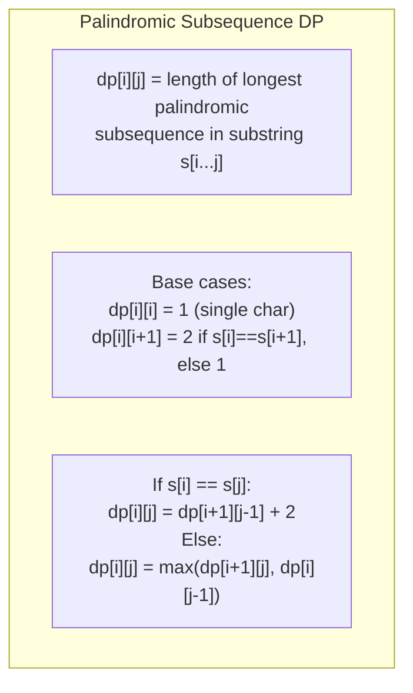

### Example: "bbbab"

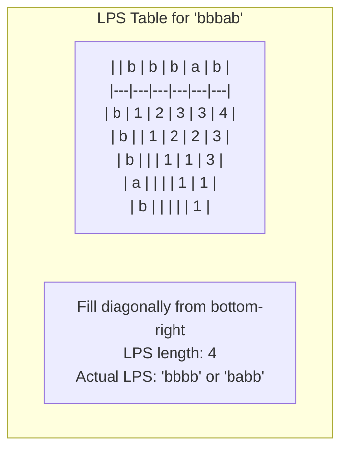

## Word Break Problem

### DP Approach for Word Break

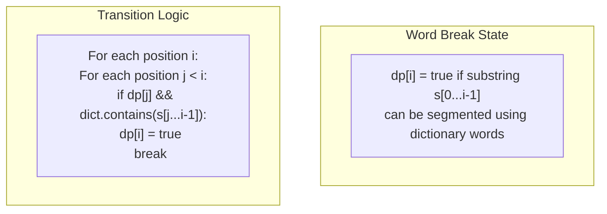

### Example: "leetcode" with dictionary ["leet", "code"]

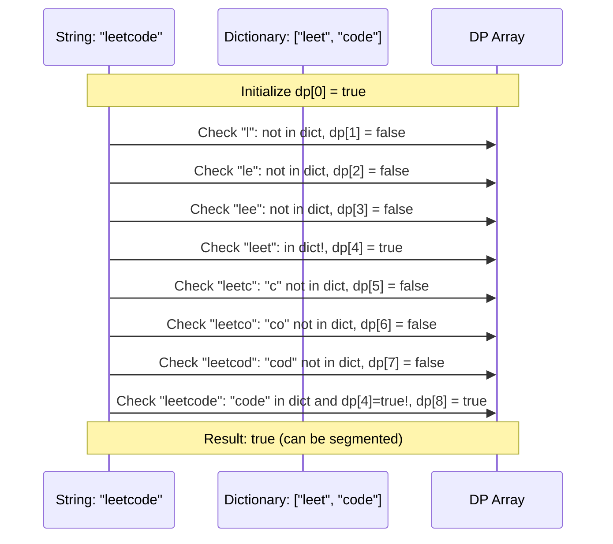

## Wildcard Pattern Matching

### State Transitions for Wildcards

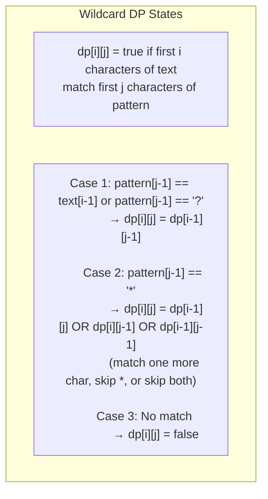

### Example: Text "adceb", Pattern "a*b"

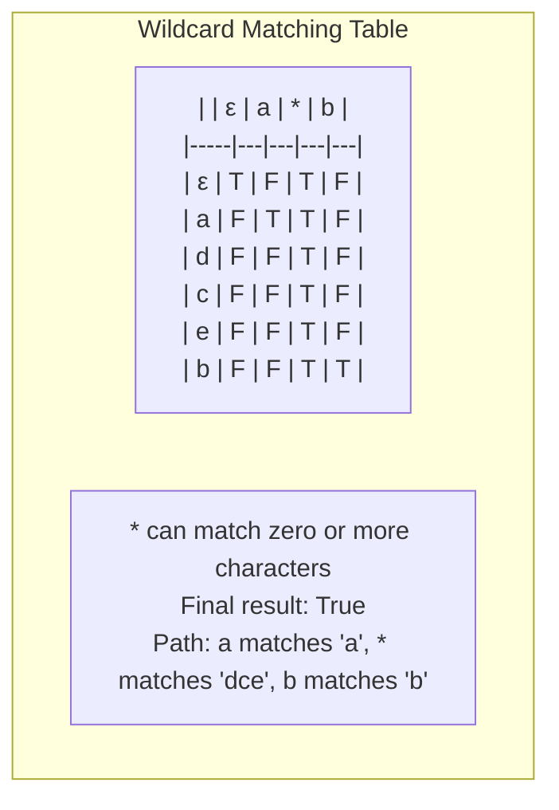

## Advanced String DP Problems

### Interleaving Strings

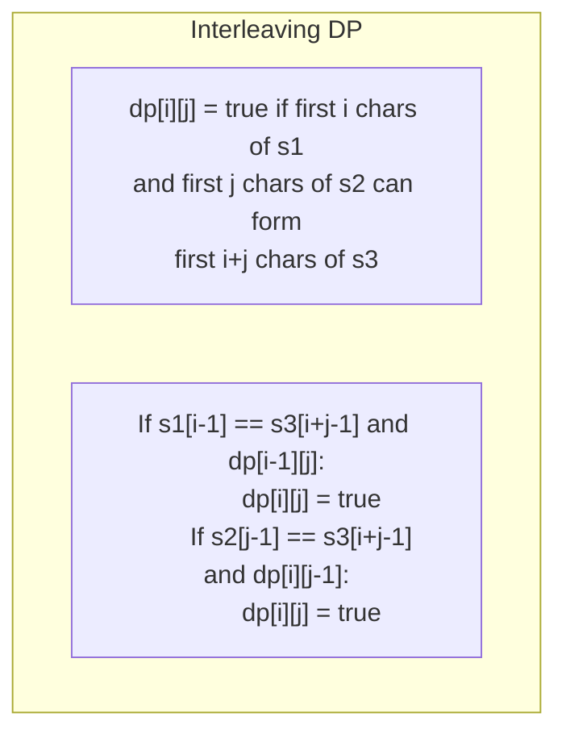

### Distinct Subsequences

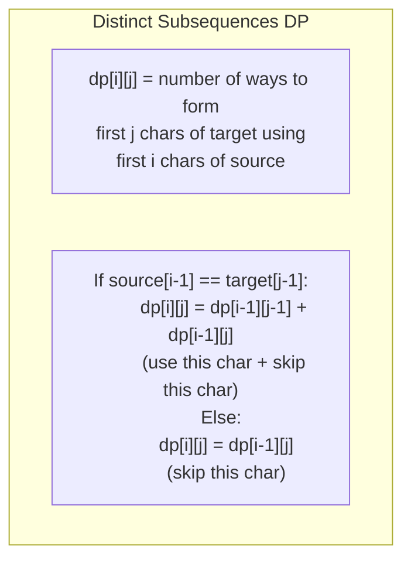

## Complexity Analysis Summary

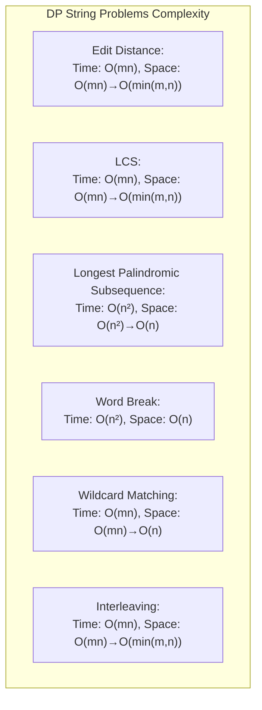

## Problem-Solving Strategy

```mermaid
flowchart TD
    Problem[String DP Problem] --> Identify{Identify Pattern}
    
    Identify -->|Two Strings| TwoString[Edit Distance, LCS, Interleaving]
    Identify -->|Single String| SingleString[LPS, Palindrome Partitioning]
    Identify -->|Pattern Matching| Pattern[Wildcard, Regex]
    Identify -->|Dictionary| Dict[Word Break, Sentence]
    
    TwoString --> Define2D[Define dp[i][j] for positions in both strings]
    SingleString --> Define1D[Define dp[i][j] for substring range]
    Pattern --> DefineMatch[Define dp[i][j] for text vs pattern]
    Dict --> DefineBreak[Define dp[i] for prefix breakability]
    
    Define2D --> BaseCase[Set base cases]
    Define1D --> BaseCase
    DefineMatch --> BaseCase
    DefineBreak --> BaseCase
    
    BaseCase --> Transition[Define state transitions]
    Transition --> Optimize[Consider space optimization]
```

## Key Insights

1. **State Design**: Clearly define what each DP state represents
2. **Base Cases**: Handle empty strings and single characters correctly
3. **Transitions**: Consider all possible operations (match, skip, transform)
4. **Space Optimization**: Often can reduce from 2D to 1D array
5. **Reconstruction**: If path/sequence needed, store parent pointers or trace back
6. **Edge Cases**: Empty strings, identical strings, completely different strings

## Next: [Advanced String Problems →](advanced-problems.md)