# Pattern Matching Algorithms - Visual Guide

This guide provides comprehensive visualizations of string pattern matching algorithms essential for technical interviews.

## Algorithm Overview and Selection

```mermaid
graph TB
    subgraph "Pattern Matching Algorithms"
        A[Input Requirements] --> B{Pattern Length}
        
        B -->|Short m<100| C[Brute Force O(nm)]
        B -->|Medium m<1000| D[KMP O(n+m)]
        B -->|Multiple patterns| E[Aho-Corasick]
        
        A --> F{Text Length}
        F -->|Large n>10⁶| G[Boyer-Moore]
        F -->|Rolling hash| H[Rabin-Karp]
        
        A --> I{Pattern Type}
        I -->|Exact match| J[KMP/Boyer-Moore]
        I -->|Wildcards| K[Dynamic Programming]
        I -->|Regular expressions| L[Finite Automaton]
    end
```

## Brute Force Algorithm

### Step-by-Step Visualization

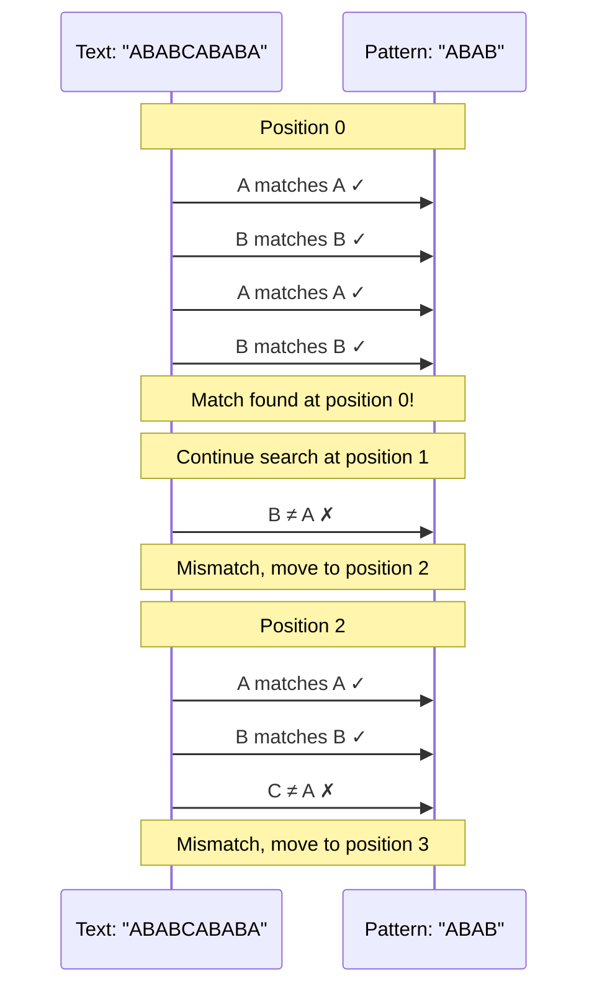

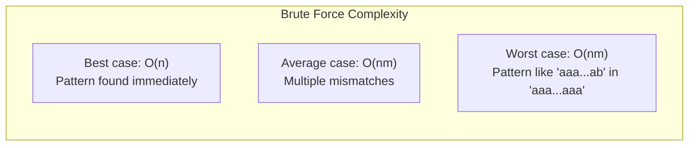

## KMP (Knuth-Morris-Pratt) Algorithm

### Failure Function Construction

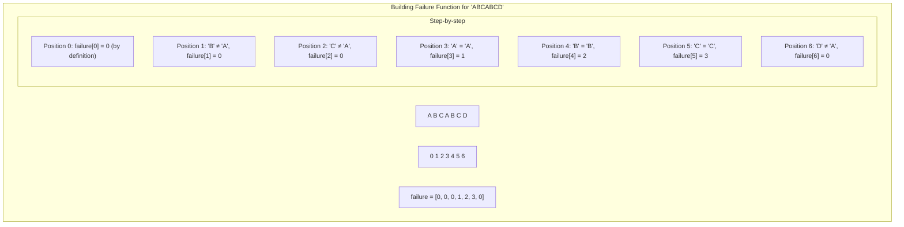

### Pattern Matching with KMP

```mermaid
sequenceDiagram
    participant T as Text: "ABCABCABCABCD"
    participant P as Pattern: "ABCABCD"
    participant F as Failure: "[0,0,0,1,2,3,0]"
    
    Note over T,P,F: Start matching
    loop Character comparison
        T->>P: Compare characters
        alt Match
            P->>F: Continue to next position
        else Mismatch
            P->>F: Use failure function to skip
            Note over T,P,F: Don't restart from beginning
        end
    end
    
    Note over T,P,F: Pattern found at position 6
```

### KMP Visualization with Mismatches

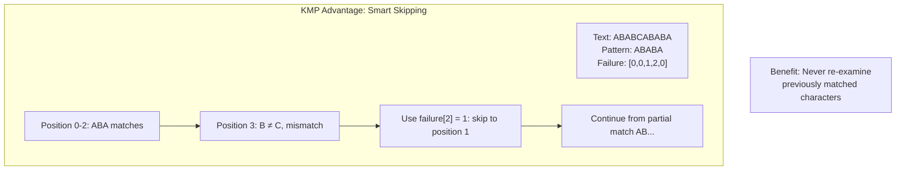

## Boyer-Moore Algorithm

### Bad Character Rule

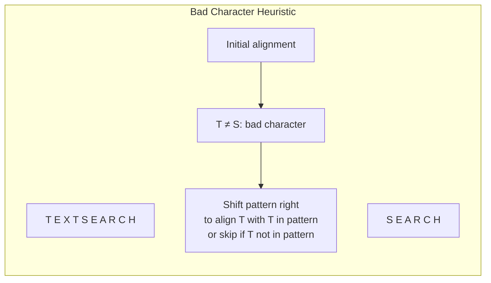

### Good Suffix Rule

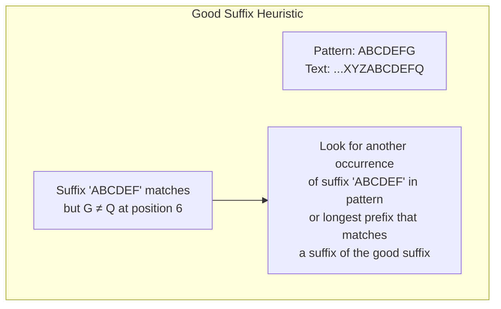

### Boyer-Moore Performance

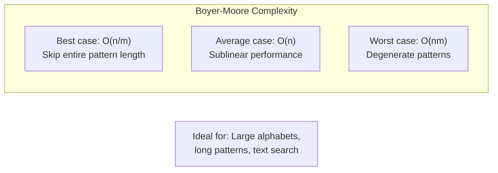

## Rabin-Karp Algorithm

### Rolling Hash Concept

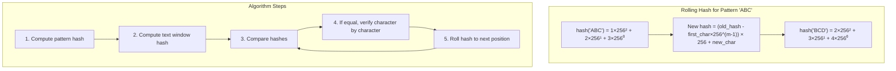

### Hash Collision Handling

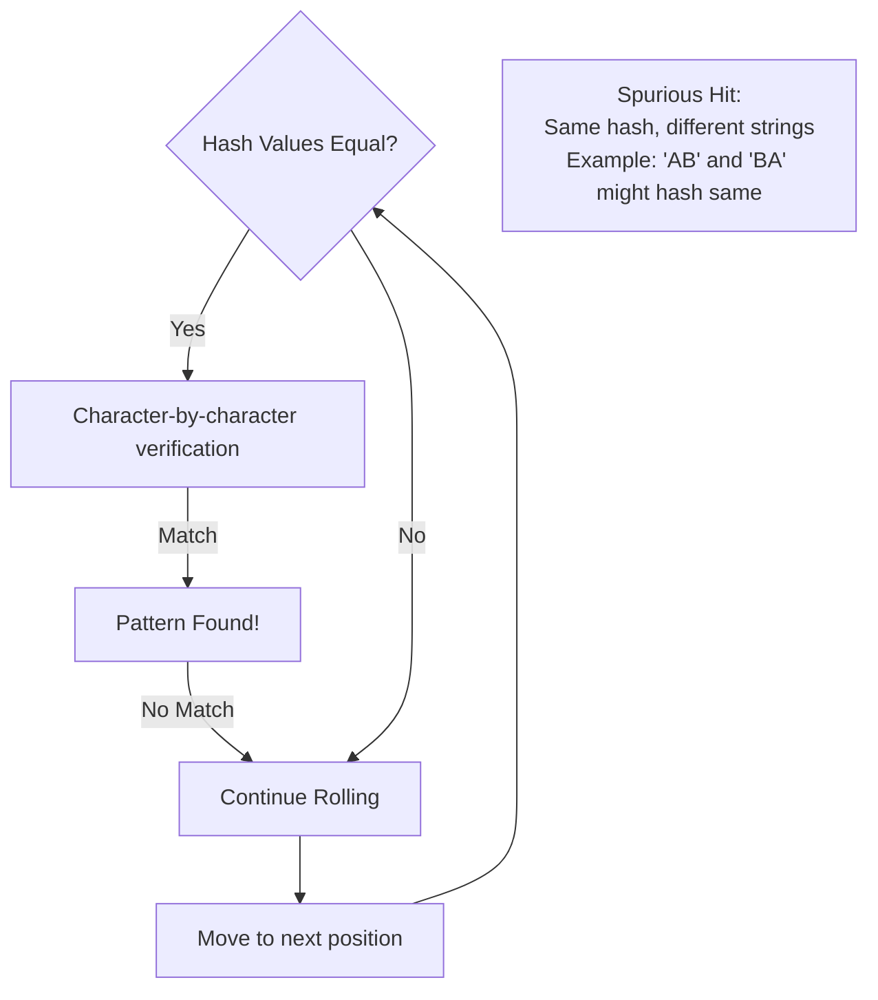

## Z-Algorithm

### Z-Array Construction

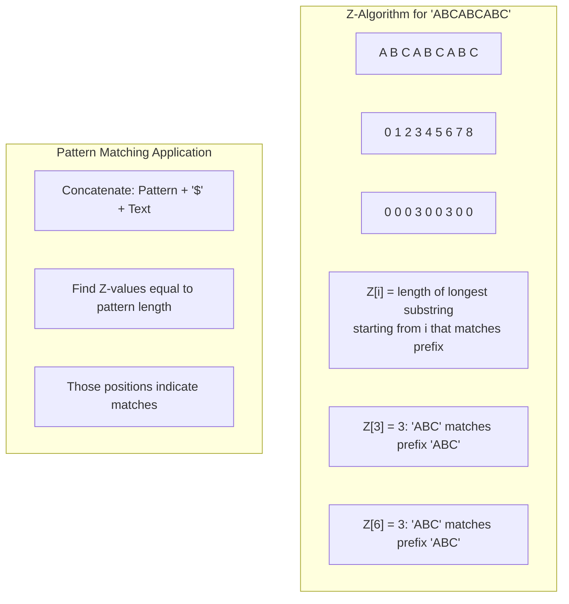

### Z-Algorithm Optimization

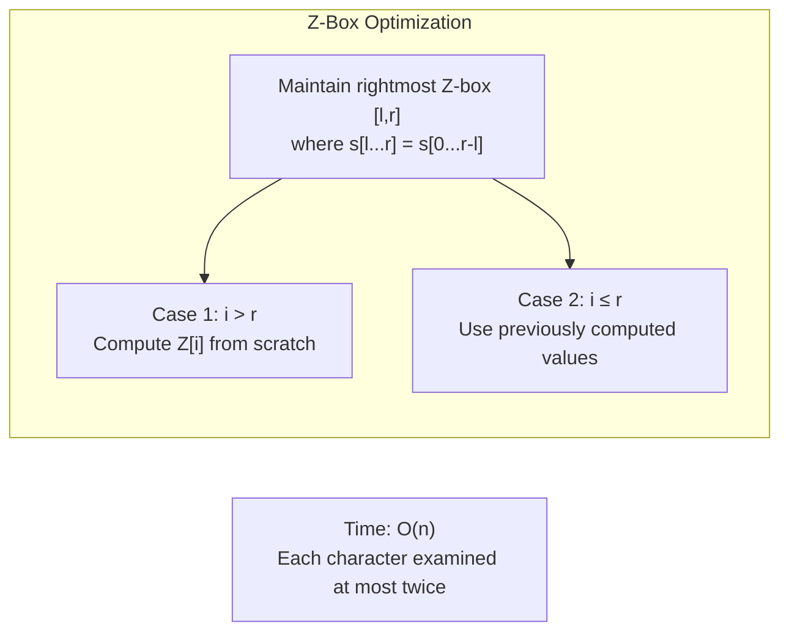

## Wildcard Pattern Matching

### Dynamic Programming Approach

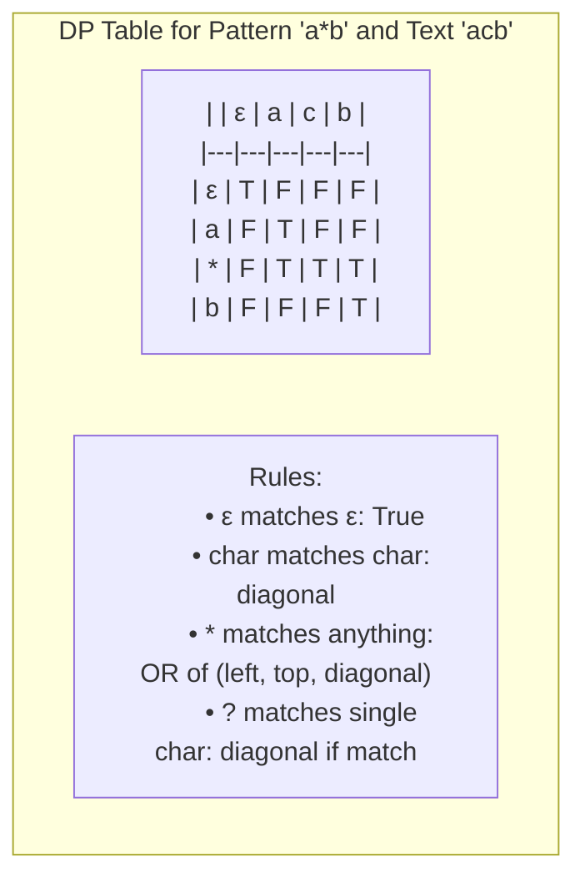

### State Transition Visualization

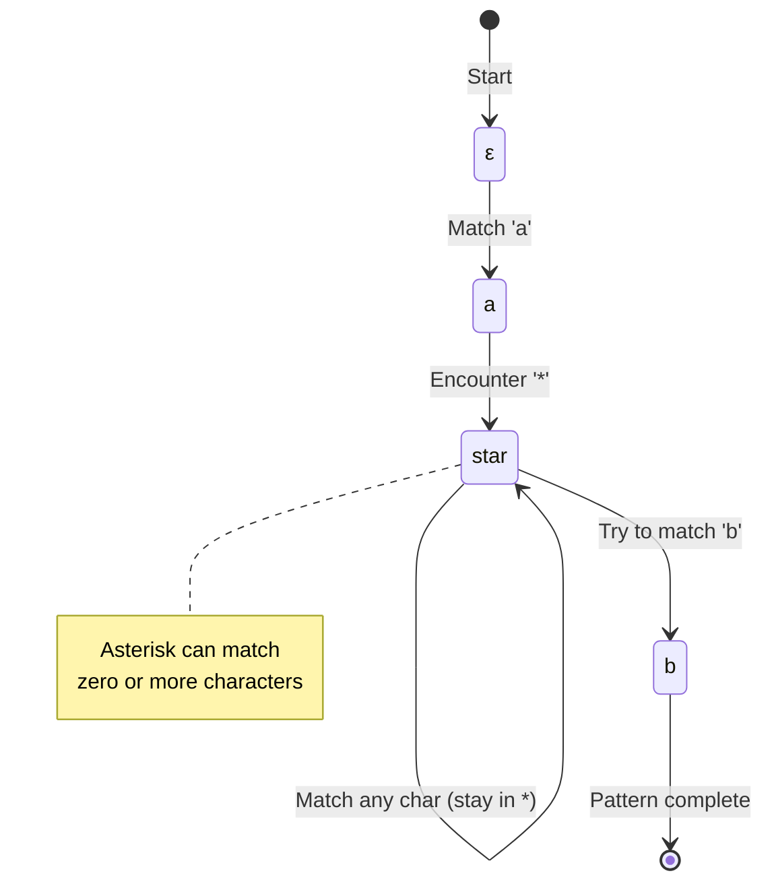

## Regular Expression Matching

### NFA Construction

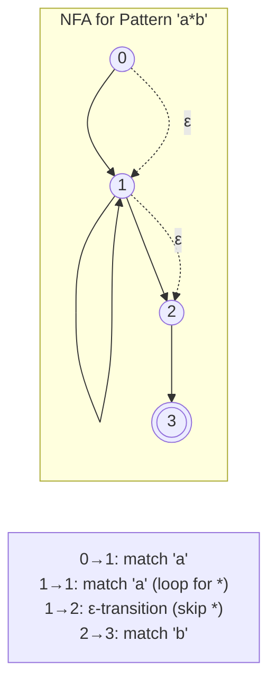

### Backtracking vs DP

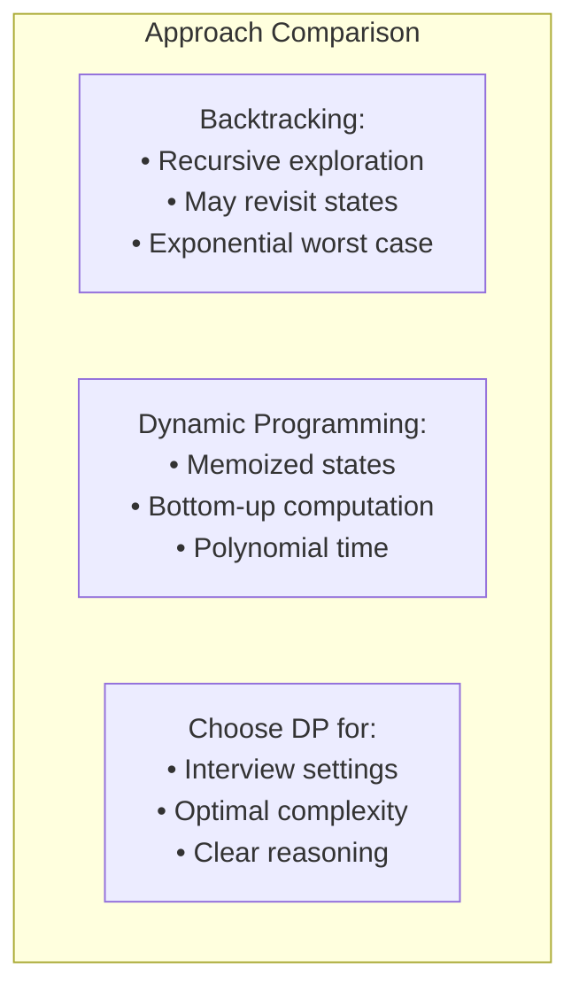

## Algorithm Selection Guide

```mermaid
flowchart TD
    Start([Pattern Matching Problem]) --> Q1{Single Pattern?}
    
    Q1 -->|Yes| Q2{Pattern Length?}
    Q1 -->|No| MultiplePatterns[Aho-Corasick Algorithm<br/>O(n + m + z)]
    
    Q2 -->|Short <10| BruteForce[Brute Force<br/>O(nm)]
    Q2 -->|Medium| Q3{Text Length?}
    Q2 -->|Long >1000| BoyerMoore[Boyer-Moore<br/>O(n/m) average]
    
    Q3 -->|Large| RabinKarp[Rabin-Karp<br/>O(n+m) expected]
    Q3 -->|Medium| KMP[KMP Algorithm<br/>O(n+m) guaranteed]
    
    Q4{Special Characters?}
    Q4 -->|Wildcards| Wildcards[DP Approach<br/>O(nm)]
    Q4 -->|Regex| Regex[NFA/DP<br/>O(nm)]
    Q4 -->|None| Q2
```

## Performance Summary

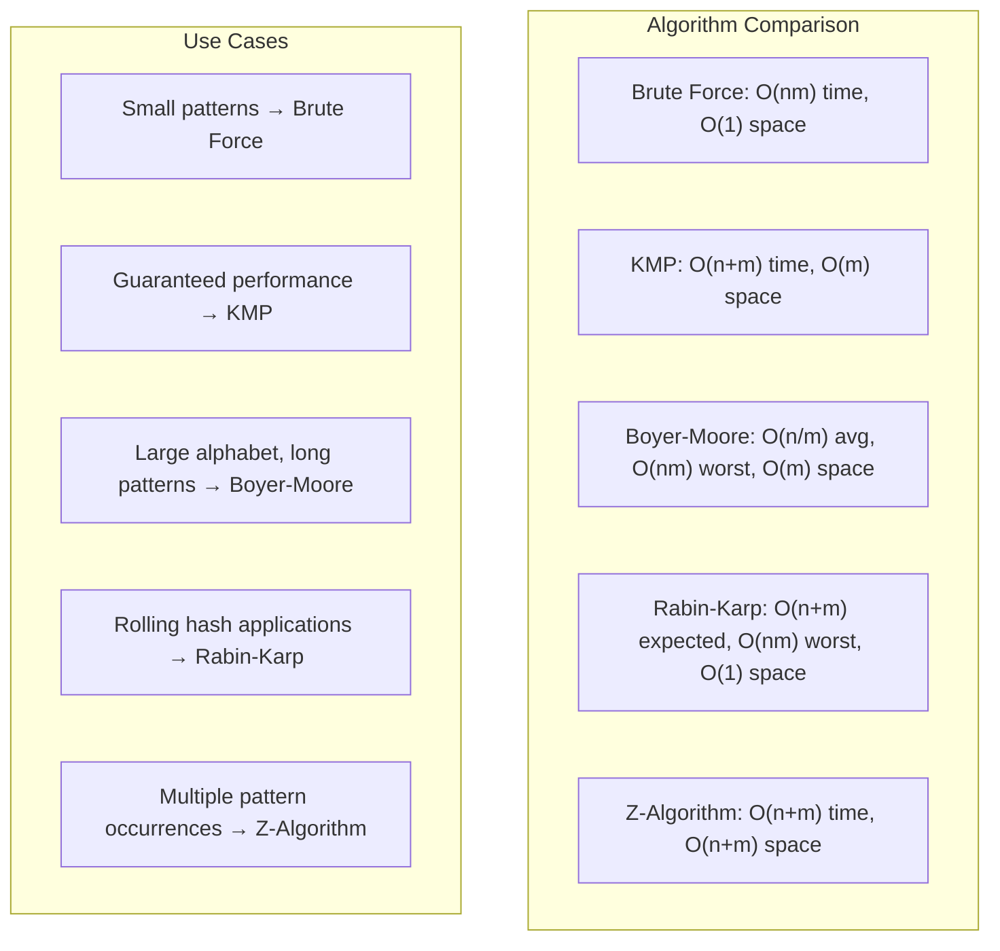

## Implementation Tips

1. **Preprocessing**: Build auxiliary structures (failure function, hash) before main algorithm
2. **Edge Cases**: Empty pattern, pattern longer than text, single character patterns
3. **Overflow**: Use modular arithmetic for rolling hash to prevent overflow
4. **Multiple Matches**: Decide whether to find first, all, or count occurrences
5. **Case Sensitivity**: Handle uppercase/lowercase requirements consistently

## Next: [Dynamic Programming on Strings →](dynamic-programming.md)