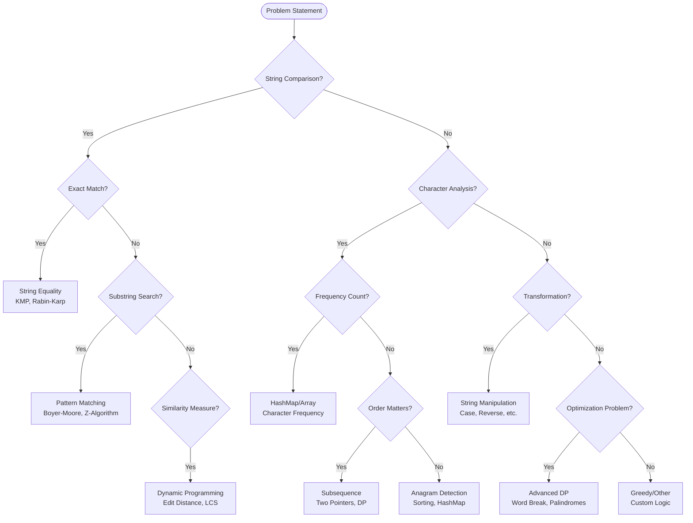
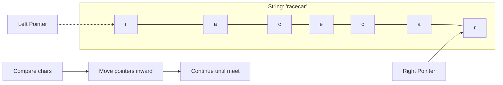
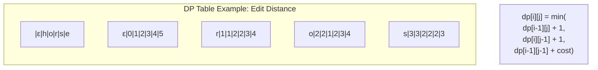
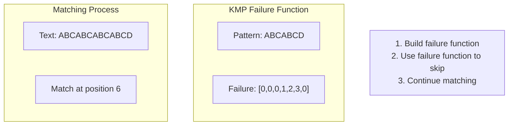
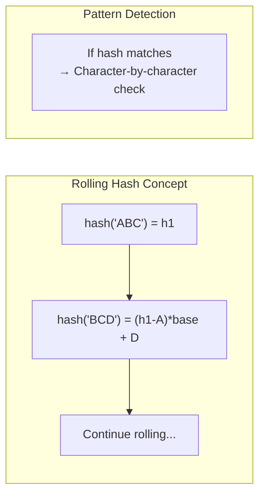
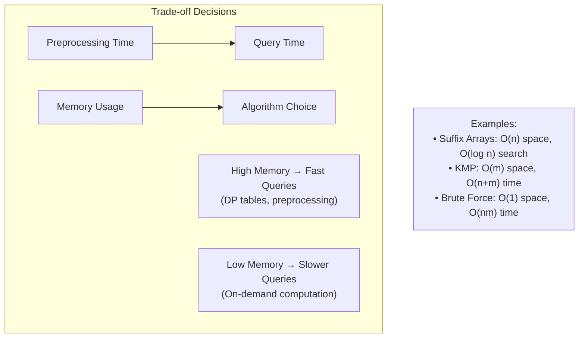

# String Algorithms - Visual Guide

This comprehensive guide provides visual representations of key string algorithms and patterns commonly encountered in technical interviews.

## Algorithm Categories Overview

```mermaid
graph TB
    A[String Algorithms] --> B[Basic Operations]
    A --> C[Pattern Matching]
    A --> D[Dynamic Programming]
    A --> E[Transformations]
    A --> F[Advanced Problems]
    
    B --> B1[Character Frequency]
    B --> B2[String Reversal]
    B --> B3[Subsequences]
    
    C --> C1[KMP Algorithm]
    C --> C2[Rabin-Karp]
    C --> C3[Boyer-Moore]
    C --> C4[Z-Algorithm]
    
    D --> D1[Edit Distance]
    D --> D2[LCS/LIS]
    D --> D3[Palindromes]
    D --> D4[Word Break]
    
    E --> E1[Case Conversion]
    E --> E2[Compression]
    E --> E3[Encoding/Decoding]
    E --> E4[Cipher Operations]
    
    F --> F1[Anagrams]
    F --> F2[String Matching]
    F --> F3[Substring Problems]
    F --> F4[Advanced DP]
```



## Complexity Analysis Reference

```mermaid
graph LR
    subgraph "Time Complexity"
        A1[O(1) - Character Access]
        A2[O(n) - Linear Scan]
        A3[O(n log n) - Sorting Based]
        A4[O(n²) - Nested Loops]
        A5[O(n³) - Triple Nested]
    end
    
    subgraph "Space Complexity"
        B1[O(1) - In-place]
        B2[O(n) - Linear Space]
        B3[O(n²) - 2D Arrays]
        B4[O(k) - Dictionary Size]
    end
```

## Pattern Recognition Flowchart



## Common String Patterns

### 1. Two Pointers Pattern
Used for: Palindrome checking, subsequence validation, in-place operations



### 2. Sliding Window Pattern
Used for: Minimum window substring, longest substring problems

```mermaid
graph TB
    subgraph "String: 'ADOBECODEBANC'"
        S[A|D|O|B|E|C|O|D|E|B|A|N|C]
    end
    
    W1[Window 1: ADO] --> W2[Window 2: DOBA]
    W2 --> W3[Window 3: BANC ✓]
    
    Note[Expand right until valid<br/>Contract left while valid]
```

### 3. Dynamic Programming Pattern
Used for: Edit distance, longest common subsequence, palindrome problems



## Algorithm Visualization Examples

### KMP Algorithm Pattern Matching



### Rabin-Karp Rolling Hash



## Problem-Solving Strategies

### Strategy Selection Guide

```mermaid
flowchart TD
    Problem[String Problem] --> Size{String Size?}
    
    Size -->|Small n≤100| BruteForce[Brute Force O(n²)]
    Size -->|Medium n≤10⁴| Optimized[Optimized O(n log n)]
    Size -->|Large n≤10⁶| Linear[Linear O(n)]
    
    BruteForce --> Check1{Correctness First?}
    Optimized --> Check2{Pattern Matching?}
    Linear --> Check3{Single Pass Possible?}
    
    Check1 -->|Yes| Implement1[Simple Nested Loops]
    Check2 -->|Yes| Implement2[KMP/Rabin-Karp]
    Check3 -->|Yes| Implement3[Two Pointers/Sliding Window]
    
    Check1 -->|No| Optimize1[Think DP/Greedy]
    Check2 -->|No| Optimize2[HashMap/Sorting]
    Check3 -->|No| Optimize3[Advanced Data Structures]
```

### Time vs Space Trade-offs



## Next Steps

- [Basic String Operations](basic-operations.md)
- [Pattern Matching Algorithms](pattern-matching.md)
- [Dynamic Programming on Strings](dynamic-programming.md)
- [Advanced String Problems](advanced-problems.md)

## Quick Reference

| Problem Type | Best Algorithm | Time | Space |
|--------------|----------------|------|-------|
| Exact Pattern Match | KMP | O(n+m) | O(m) |
| Multiple Pattern Search | Aho-Corasick | O(n+z) | O(total pattern length) |
| Edit Distance | DP | O(nm) | O(n) |
| Longest Palindrome | Expand Around Centers | O(n²) | O(1) |
| Anagram Check | Sorting/HashMap | O(n log n)/O(n) | O(1)/O(k) |